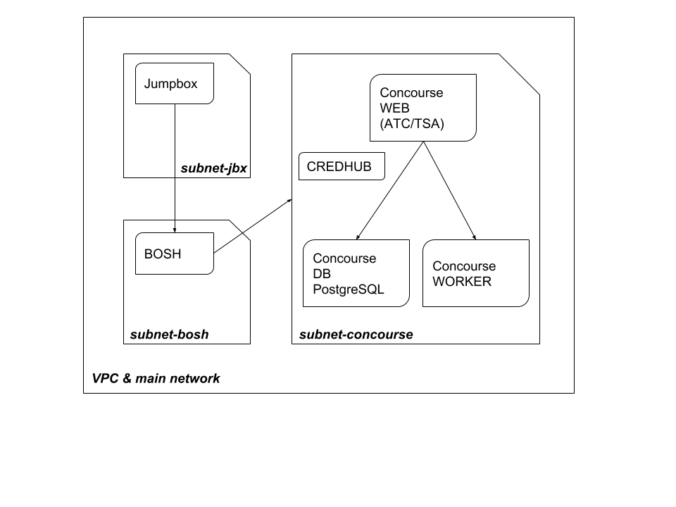

```bash
 ____   _    ____        _               _                 _             
|  _ \ / \  / ___|   ___| |_ ___ _ __   | |__  _   _   ___| |_ ___ _ __  
| |_) / _ \ \___ \  / __| __/ _ \ '_ \  | '_ \| | | | / __| __/ _ \ '_ \ 
|  __/ ___ \ ___) | \__ \ ||  __/ |_) | | |_) | |_| | \__ \ ||  __/ |_) |
|_| /_/   \_\____/  |___/\__\___| .__/  |_.__/ \__, | |___/\__\___| .__/ 
                                |_|            |___/              |_|    
```

PAS (Pivotal Application Service) step by step is a training program to help you learning how to deploy Pivotal Cloud Foundry.

# Overview

The first round for this step by step training is based on Google cloud provider.

1. Deploy management infrastructure
2. Create a jumpbox
3. From jumpbox create a management BOSH director
4. From jumpbox and using management BOSH director deploy concourse
5. Create pipelines:
	1. deploy PAS infrastructure using terraform
	2. deploy opsman
	3. using opsman deploy PAS

	
# Step1: deploy management infrastructure

To deploy *management infrastructure* we are using a custom terraform recipe. 



## Network and subnets

Main network is named `${var.env_name}-mgmt-network` and rely on 3 subnets:

 - `${var.env_name}-jbx-subnet` : dedicated to jumpbox
 - `${var.env_name}-bosh-subnet` : dedicated to BOSH (the management one)
 - `${var.env_name}-concourse-subnet` : dedicated to concourse

### Subnets CIDRs:

* Jumpbox CIDR: 10.0.10.0/24
* BOSH CIDR: 10.0.20.0/24
* Concourse CIDR: 10.0.30.0/24

| Network | Subnets | Instances |
|:--------|:--------|:----------|
| ${var.env-name}-mgmt-network | ${var.env_name}-jbx-subnet | jumpbox |
| ${var.env-name}-mgmt-network | ${var.env_name}-bosh-subnet | bosh director |
| ${var.env-name}-mgmt-network | ${var.env_name}-concourse-subnet | concourse web |
| ${var.env-name}-mgmt-network | ${var.env_name}-concourse-subnet | concourse db |
| ${var.env-name}-mgmt-network | ${var.env_name}-concourse-subnet | concourse worker |

## Firewall

No firewall rules at this point as there is no instance deployed yet. Rules will be added when resources will come up.

## Run

```bash
terraform init
terraform plan -out plan
terraform apply plan
```

# Step2: create a jumpbox

## Network and subnet

| Network | Subnets | Instances |
|:--------|:--------|:----------|
| ${var.env-name}-mgmt-network | ${var.env_name}-jbx-subnet | jumpbox |

Private ip address is dynamically allocated using DHCP.

## DNS

A dns is used for jumpbox, so you have to set up a new dns record for ${var.env_name}.\<your domain name\>. with dns provided by Google DNS.

## Firewall

In order to access to jumpbox using SSH, open port 22 from anywhere to jumpbox.

## Run

```bash
terraform -out plan
terraform apply plan
```

## Test

Connect to the jumpbox using ssh anf gcloud:

```bash
gcloud compute --project "<GCP PROJECT NAME>" ssh --zone "<GCP ZONE>" "<YOUR LOCAL USER>@${var.env_name}-jbx"
```